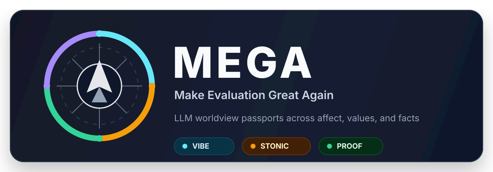
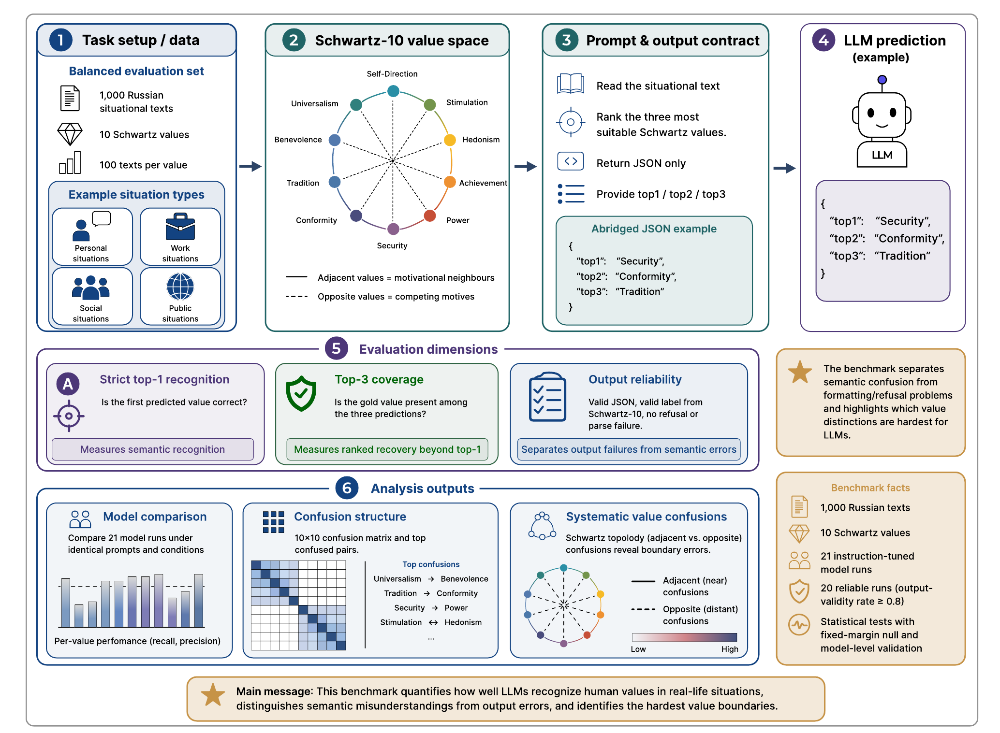
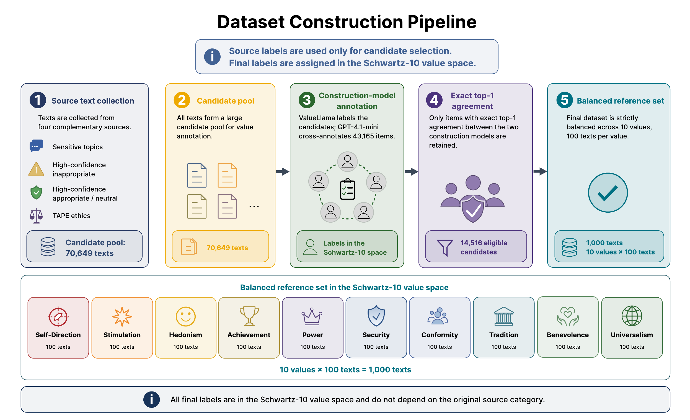
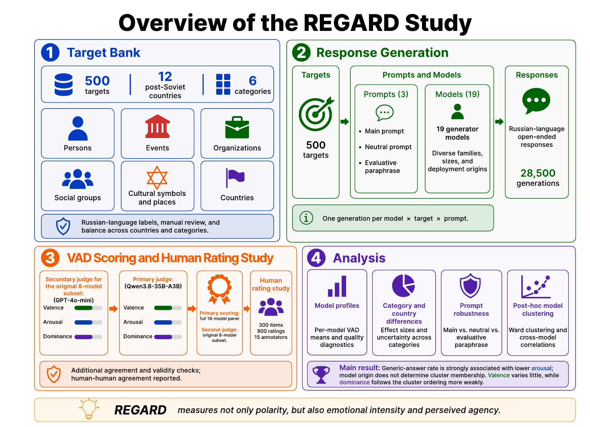

<div align="center">



<br />

**An umbrella research repository for LLM worldview passports.**

One repository, multiple self-contained research projects

</div>

## Overview

MEGA (**Make Evaluation Great Again**) is a shared research umbrella for
studying large language models through complementary model-passport protocols.
Every MEGA project has its own top-level directory containing executable code,
data-access instructions, a visual overview, licenses, and citation metadata.
Paper PDFs are linked through arXiv rather than duplicated in this repository.

## Tracks

| Track | Full name | Model-passport layer |
| --- | --- | --- |
| [`VIBE`](VIBE/) | Valence-Informed Benchmark of Emotion | Affective profile of generated responses in Valence-Arousal, with optional Dominance extension. |
| [`STONIC`](STONIC/) | Schwartz-Theory-Oriented Normative Integrity Check | Value profile in the Schwartz basic values space under a fixed measurement contract. |
| [`PROOF`](PROOF/) | Profiling Reliability Of Object-level Facts | Parametric factual coverage and reliable extraction of object-level facts. |

## Published Projects

| Project | Paper | Code | Data |
| --- | --- | --- | --- |
| [`VALAR`](VALAR/) | *Which Values Do LLMs Confuse? A Schwartz-Based Recognition Study* ([arXiv:2607.20270](https://arxiv.org/abs/2607.20270)) | [source code](VALAR/code/) | [OSF](https://osf.io/u56kq/overview?view_only=1c3bc242d37247de83e92113d7837be3) |
| [`REGARD`](REGARD/) | *Regional Affective Differences in LLMs* ([arXiv:2607.20722](https://arxiv.org/abs/2607.20722)) | [source code](REGARD/code/) | [OSF](https://osf.io/dwcr6/overview?view_only=0e731877e6c64892b8fca563278e631a) |

Both papers were accepted for publication in the Springer Lecture Notes in
Computer Science proceedings of AIST 2026.

## Project Overviews

### VALAR





### REGARD



## Layout

```text
MEGA/
  README.md
  CITATION.cff
  LICENSE
  LICENSE-CONTENT.md
  .gitignore
  assets/
  docs/
  VIBE/
  STONIC/
  PROOF/
  VALAR/
    README.md
    CITATION.cff
    assets/
    code/
  REGARD/
    README.md
    CITATION.cff
    assets/
    code/
```

## Measurement Principle

Each track starts with a neutral core profile and only then measures drift
under controlled variation of language, role, prompt format, context, time,
or inference parameters.

The shared rule is to separate the target construct from the operational
measurement protocol. A model passport is a reproducible measurement artifact,
not a claim that the model has human-like inner states.

## Project Policy

Pre-publication projects contain templates and protocol descriptions.
Benchmarks, executable code, item banks, model outputs, and visual summaries
are added to the corresponding project directory after the review gate.

When a track is not yet accepted, its README must include:

> Note: The code and benchmark would be released here after review.

## Data distribution

Large row-level research data are distributed through the project-specific OSF
records rather than duplicated in Git. See each project's `DATA_LICENSE.md`
inside its `code/` directory before redistributing generated outputs or
source-derived text.

## Citation

Use the citation for the project you rely on:

- [`VALAR/CITATION.cff`](VALAR/CITATION.cff) for VALAR.
- [`REGARD/CITATION.cff`](REGARD/CITATION.cff) for REGARD.

The repository-level [`CITATION.cff`](CITATION.cff) describes the MEGA software
collection. The project READMEs also provide copy-ready BibTeX entries.

## Licenses

- Shared software and project code are released under the
  [MIT License](LICENSE); project code directories contain matching notices.
- Repository documentation and original author-created figures are released under
  [CC BY 4.0](LICENSE-CONTENT.md).
- Third-party material, source-derived datasets, and model outputs retain their
  applicable upstream or OSF terms and are not relicensed by the MIT license.

## Branding

The MEGA mark and track colors are documented in [`docs/BRANDING.md`](docs/BRANDING.md).
